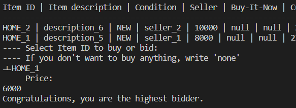

# Auction Simulation

---


## 1. ER model


###  Users
| Name        | Type            | Feature |
|-------------|-----------------|---------|
| id          | serial          | pk      |
| name        | varchar(255) |         |
| password | varchar(255) |         |

- ‘id’ is a serial type. It is automatically registered even if the ‘id’ is not set, increasing by 1 each time it is registered. (ex: 1, 2, 3, …) The same is true at other tables.
- ‘name’ is expressed as an ‘id’ on the program. You can enter ‘name’ to ask for ‘id’ in the program. The ‘id’ of the table is just a value for distinguishing objects. It’s not really a meaningful value. Rather, the name has a meaningful value. (ex: Login --> user Id: name) The same is true at other tables.
- ‘user_type’ is divided into ‘ADMINITRATOR’ and ‘NORMAL’.


###  Item

| Name             | Type         | Feature              |
|------------------|--------------|----------------------|
| id               | serial       | pk                   |
| name             | varchar(255) |                      |
| category         | varchar(255) |                      |
| condition        | varchar(255) |                      |
| description      | varchar(255) |                      |
| buy_it_now_price | int          |                      |
| bid_closing_date | timestamp    |                      |
| seller_id        | int          | FK(User)             |
| date_posted      | timestamp    | default now          |
| sold             | int          | default 0, if sold 1 |


* ‘category’ list is as follows ‘ELECTRONICS’, ‘BOOKS’, ‘HOME’, ‘CLOTHING’, ‘SPORTINGGOOS’, ‘OTHERS’.
* ‘condition’ list is as follows ‘NEW’, ‘LIKE_NEW’, ‘GOOD’, ‘ACCEPTABLE’.
* ‘sold’ means whether the item has been sold. It has a value of 0 at first. If the item was sold, it has a value 1.

### Bid

| Name             | Type      | Feature     |
|------------------|-----------|-------------|
| id               | serial    | pk          |
| bidder_id        | int       | fk(User)    |
| item_id          | int       | fk(Item)    |
| bid_price        | int       |             |
| date_posted      | timestamp | default now |


### Billing

| Name                                     | Type      | Feature     |
|------------------------------------------|-----------|-------------|
| id                                       | serial    | pk          |
| sold_item_id                             | int       | fk(Item)    |
| purchase_date                            | timestamp | default now |
| seller_id                                | int       | fk(User)    |
| buyer_id                                 | int       | fk(User     |
| amount_due_buyers_need_to_pay            | int       |             |
| amount_of_money_sellers_need_to_get_paid | int       |             |


## 2. ddl.sql (create tables)

```
create table users (
    id serial primary key,
    name varchar(255),
    password varchar(255),
    user_type varchar(255)
);
```

```
create table item (
    id serial primary key,
    name varchar(255),
    category varchar(255),
    condition varchar(255),
    description varchar(255),
    buy_it_now_price int,
    bid_closing_date timestamp,
    seller_id int,
    date_posted timestamp default current_timestamp,
    sold int default 0,
    
    constraint fk_seller_id foreign key(seller_id) references users(id) on delete cascade on update cascade 
);
```

```
create table bid (
    id serial primary key,
    bidder_id int,
    item_id int,
    bid_price int,
    date_posted timestamp default current_timestamp,
    
    constraint fk_item_id foreign key(item_id) references item(id) on delete cascade on update cascade,
    constraint fk_bidder_id foreign key(bidder_id) references users(id) on delete cascade on update cascade
);
```

```
create table billing (
    id serial primary key,
    sold_item_id int,
    purchase_date timestamp default current_timestamp,
    seller_id int,
    buyer_id int,
    amount_due_buyers_need_to_pay int,
    amount_of_money_sellers_need_to_get_paid int,
    
    constraint fk_sold_item_id foreign key(sold_item_id) references item(id) on delete cascade on update cascade,
    constraint fk_seller_id foreign key(seller_id) references users(id) on delete cascade on update cascade,
    constraint fk_buyer_id foreign key(buyer_id) references users(id) on delete cascade on update cascade
);
```


## 3. data.sql (Insert statements)

### 3-0. Initialize Sequence
```
ALTER SEQUENCE users_id_seq RESTART WITH 1;
ALTER SEQUENCE item_id_seq RESTART WITH 1;
ALTER SEQUENCE bid_id_seq RESTART WITH 1;
ALTER SEQUENCE billing_id_seq RESTART WITH 1;
```
* If you want to put dummy data back in the table, you must reset the sequence first. Simply delete the data of the table does not return the id value to 1.

### 3-1. Insert Users
```
insert into users (name, password, user_type) values ('admin', 'password_admin', 'ADMINISTRATOR');
insert into users (name, password, user_type) values ('seller_1', 'password_seller_1', 'NORMAL');
insert into users (name, password, user_type) values ('seller_2', 'password_seller_2', 'NORMAL'); insert into users (name, password, user_type) values ('buyer_1', 'password_buyer_1', 'NORMAL');
insert into users (name, password, user_type) values ('buyer_2', 'password_buyer_2', 'NORMAL');
```

### 3-2. Insert Items
```
insert into item (name, category, condition, description, buy_it_now_price, bid_closing_date, seller_id) values ('ELECTRONICS_1', 'ELECTRONICS', 'NEW', 'description_1', 1000, '2023-10-20 12:00', 2);
insert into item (name, category, condition, description, buy_it_now_price, bid_closing_date, seller_id) values ('BOOKS_1', 'BOOKS', 'LIKE_NEW', 'description_2', 2000, '2023-10-21 12:00', 2);
insert into item (name, category, condition, description, buy_it_now_price, bid_closing_date, seller_id) values ('ELECTRONICS_2', 'ELECTRONICS', 'GOOD', 'description_3', 3000, '2023-10-22 12:00', 3);
insert into item (name, category, condition, description, buy_it_now_price, bid_closing_date, seller_id) values ('BOOKS_2', 'BOOKS', 'ACCEPTABLE', 'description_4', 4000, '2023-10-23 12:00', 3);
insert into item (name, category, condition, description, buy_it_now_price, bid_closing_date, seller_id) values ('HOME_1', 'HOME', 'NEW', 'description_5', 8000, '2023-11-01 13:45', 2);
insert into item (name, category, condition, description, buy_it_now_price, bid_closing_date, seller_id) values ('HOME_2', 'HOME', 'NEW', 'description_6', 10000, '2023-11-02 19:54', 3);
```

* ‘ELECTRONICS_1’, ‘BOOKS_1’, ‘ELECRONICS_2’, ‘BOOKS_2’ are already passed the ‘bid_closing_date’. If the user checks the account, they will be automatically added to Billing. They don’t appear on ‘Buy Item’ because they are out of ‘bid_closing_date’.
* ‘HOME_1’, ‘HOME_2’ are still have a period of the ‘bid_closing_date’ left. So, they appear on ‘Buy Item’.

### 3-3. Insert Bid
```
insert into bid (bidder_id, item_id, bid_price) values (4, 1, 900); insert into bid (bidder_id, item_id, bid_price) values (4, 2, 1000);
insert into bid (bidder_id, item_id, bid_price) values (4, 3, 2900); insert into bid (bidder_id, item_id, bid_price) values (4, 4, 2000);
insert into bid (bidder_id, item_id, bid_price) values (5, 1, 500); insert into bid (bidder_id, item_id, bid_price) values (5, 2, 1900);
insert into bid (bidder_id, item_id, bid_price) values (5, 3, 1500); insert into bid (bidder_id, item_id, bid_price) values (5, 4, 3900);
```
* ‘ELECRONICS_1’, ‘BOOKS_1’, ‘ELECRONICS_2’, ‘BOOKS_2’ are already have bids.


### 3-4. Billing
There is no dummy data on ‘Billing’. Instead, items that have already passed the bid period have been registered, so run ‘Check your Account’ and they will be registered on Billing.

<br><br>

## 4. Functional Description
In this part, I will show the query statements used with the function. Keep in mind that the values in the query statement are examples only. You need to see the code for details.
<br><br>
If you enter ‘make run’, the program runs.


## 4-1. Login Menu
To login, you must enter the ‘users’ ‘name’ and ‘password’ (not id!)


[Query]<br>
`select password from users where name = ‘seller_2’;`

<br><br>
### Sell Menu


[Query]<br>
`insert into item (name, category, condition, description, buy_it_now_price, bid_closing_date, seller_id) values ('Hoover', 'ELECTRONICS', 'NEW', 'description_1', 1000, '2023-12-25 12:00', 2);`


<br><br>
### Status of You Item Listed on Action


[Query]<br>
```
select i.name, u.name, b.bid_price, b.date_posted
from item as i
left outer join bid as b on i.id = b.item_id
left outer join users as u on b.bidder_id = u.id
where i.seller_id = 2;
```


<br><br>
### Buy Item


[Query]<br>
```
select i.name, i.description, i.condition, u.name, i.buy_it_now_price, b.bid_price, s.name, concat(extract(day from age(i.bid_closing_date, current_timestamp)), ' day ', extract(hour from age(i.bid_closing_date, current_timestamp)), ' hrs') as time_difference, i.bid_closing_date
from item as i
left outer join (
    select item_id, max(bid_price) as max_bid_price
    from bid
    group by item_id
) as max_bids on i.id = max_bids.item_id
left outer join bid as b on i.id = b.item_id and b.bid_price = max_bids.max_bid_price
left outer join users as u on i.seller_id = u.id
left outer join users as s on b.bidder_id = s.id
where i.category = 'HOME' and i.condition = 'NEW' and i.description like '%des%' and i.date_posted between '2000-10-10' and current_timestamp and i.bid_closing_date > current_timestamp;
```
<br><br>


Price was entered below the ‘Buy-It-Now’, so add ‘HOME_1’ to bid.<br>
[Query]<br>
`insert into bid (bidder_id, item_id, bid_price) values (2, 5, 6000);`

<br><br>

Price was entered over the ‘Buy-It-Now’, so add ‘HOME_2’ to billing and update ‘sold’ to 1. (‘sold’ means it is sold)<br>
[Query]<br>
```
insert into billing (sold_item_id, seller_id, buyer_id, amount_due_buyers_need_to_pay, amount_of_money_sellers_need_to_get_paid) values (6, 3, 2, 10000, 9000);
update item set sold = 1 where name = 'HOME_2’;
```


<br><br>
### Check Status of your Bid

[Query]<br>
```
select i.name, i.description, u.name, b.bid_price, d.bid_price, i.bid_closing_date
from item as i
join (
    select item_id, max(bid_price) as max_bid_price
    from bid
    group by item_id
) as max_bids on i.id = max_bids.item_id
join bid as b on i.id = b.item_id and b.bid_price = max_bids.max_bid_price
join bid as d on i.id = d.item_id
join users as u on b.bidder_id = u.id
where d.bidder_id = 2;
```
<br><br>
### Check your Account
First, if current time passed ‘bid_closing_date’ and ‘sold’ is 0, make billing and set ‘sold’ to 1.<br>
[Query]<br>
```
select i.id, i.bid_closing_date, i.seller_id, b.bidder_id, b.bid_price, floor(b.bid_price * 0.9)
from item as i
join (
select item_id, max(bid_price) as max_bid_price
from bid
group by item_id
) as max_bids on i.id = max_bids.item_id
join bid as b on i.id = b.item_id and b.bid_price = max_bids.max_bid_price
where i.bid_closing_date < current_date and i.sold = 0;

insert into billing (sold_item_id, purchase_date, seller_id, buyer_id, amount_due_buyers_need_to_pay, amount_of_money_sellers_need_to_get_paid) values (2, ‘2023-10-20 12:00’, 2, 4, 900, 810);
update item set sold = 1 where id = 2;
```

<br><br>


[Query] Sold Items <br>
```
select i.category, i.name, b.purchase_date, b.amount_due_buyers_need_to_pay, u.name, floor(b.amount_due_buyers_need_to_pay * 0.1)
from item as i
join billing as b on i.id = b.sold_item_id
join users as u on b.buyer_id = u.id
where b.seller_id = 2;
```

[Query] Purchased Items <br>
```
select i.category, i.name, b.purchase_date, b.amount_due_buyers_need_to_pay, u.name
from item as i
join billing as b on i.id = b.sold_item_id
join users as u on b.seller_id = u.id
where b.buyer_id = 2;
```
<br><br>
## 4-2. Sign Up


[Query]<br>
`insert into users (name, password, user_type) values ('userTest', 'password_userTest', 'ADMINISTRATOR');`

<br><br>
## 4-3. Login as Administrator


[Query]<br>
`select id, password, user_type from users where name = 'admin';`


<br><br>
### Print Sold Items per Category


[Query]<br>
```
select i.name, b.purchase_date, s.name, u.name, b.amount_due_buyers_need_to_pay, floor(b.amount_due_buyers_need_to_pay * 0.1)
from item as i
join billing as b on b.sold_item_id = i.id
join users as s on s.id = b.seller_id
join users as u on u.id = b.buyer_id
where i.category = 'ELECTRONICS';
```

<br><br>
### Print Account Balance for Seller


[Query]<br>
```
select i.name, b.purchase_date, u.name, b.amount_due_buyers_need_to_pay, floor(b.amount_due_buyers_need_to_pay)
from item as i
join billing as b on b.sold_item_id = i.id
join users as u on u.id = b.buyer_id
join users as s on s.id = b.seller_id
where s.name = 'seller_1';
```

<br><br>
### Print Seller Ranking


It is arranged in descending order based on Total Profit<br>
[Query]<br>
```
select u.name, count(b.id), sum(b.amount_due_buyers_need_to_pay)
from users as u
join billing as b on u.id = b.seller_id
group by u.id
order by sum(b.amount_due_buyers_need_to_pay) desc;
```

<br><br>
### Print Buyer Ranking


It is arranged in descending order based on Total Money Spent<br>
[Query]<br>
```
select u.name, count(b.id), sum(b.amount_due_buyers_need_to_pay)
from users as u
join billing as b on u.id = b.buyer_id
group by u.id
order by sum(b.amount_due_buyers_need_to_pay) desc;
```


